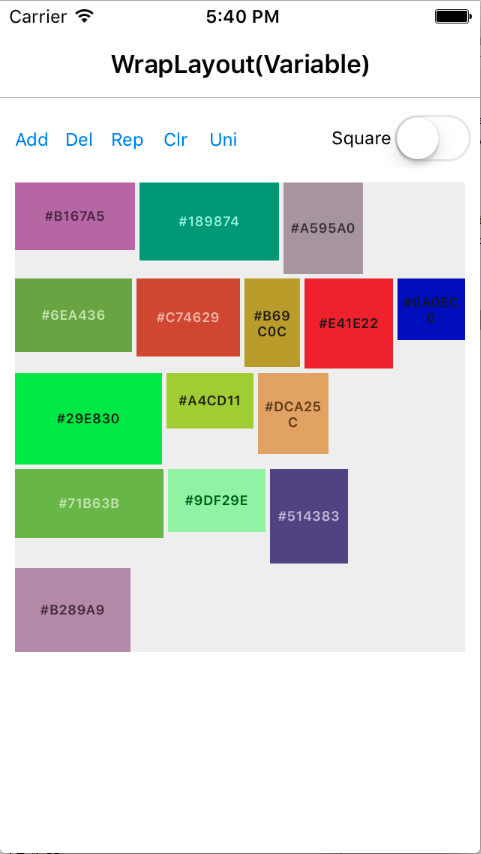
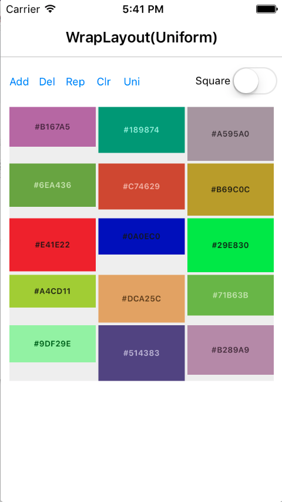
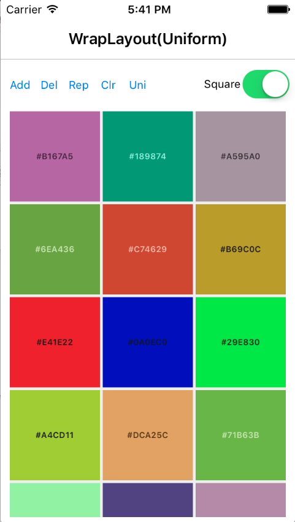

# AiForms.Layouts for Xamarin.Forms

This is a collection of  Xamarin.Forms custom layouts

## Referenced source code

* https://forums.xamarin.com/discussion/comment/57486/#Comment_57486
* https://forums.xamarin.com/discussion/21635/xforms-needs-an-itemscontrol/p2

## Features

* [WrapLayout](#wraplayout)
* [RepeatableWrapLayout](#repeatablewraplayout)
* [RepeatableStack](#repeatablestack)




## Demo

https://twitter.com/muak_x/status/830061279330996224

## Nuget Installation

```bash
Install-Package AiForms.Layouts
```

All you need to do is installing to PCL project.<br>
You need not to install this nuget package to each platform project.

## WrapLayout

This Layout performs wrapping on the boundaries.

### Parameters

* Spacing
    * added between elements
* UniformColumns
    * number for uniform child width (default 0)
    * If it is 0,it will obey WidthRequest value.
    * If it is more than 0 ,a child width will be  width which divide parent width by this number.
* IsSquare
    * If it is true,it make item height equal to item width when UniformColums > 0 (default false)

### How to write with Xaml

```xml
<ContentPage xmlns="http://xamarin.com/schemas/2014/forms"
		xmlns:x="http://schemas.microsoft.com/winfx/2009/xaml"
		xmlns:l="clr-namespace:AiForms.Layouts;assembly=AiForms.Layouts"
		x:Class="Sample.Views.MainPage">
    <StackLayout>
        <l:WrapLayout Spacing="4" UniformColumns="3" IsSquare="true" HorizontalOptions="FillAndExpand">
    		<BoxView Color="Red" />
            <BoxView Color="Blue" />
            <BoxView Color="Green" />
            <BoxView Color="Black" />
            <BoxView Color="Yellow" />
        </l:WrapLayout>
    </StackLayout>
</ContentPage>
```

## RepeatableWrapLayout

This Layout is WrapLayout corresponding to DataTemplate.

### Parameters

* ItemTapCommandProperty
    * Command invoked when a item is tapped.
* ItemsSource
* ItemTemplate

### How to write with Xaml

```xml
<ContentPage xmlns="http://xamarin.com/schemas/2014/forms"
		xmlns:x="http://schemas.microsoft.com/winfx/2009/xaml"
		xmlns:l="clr-namespace:AiForms.Layouts;assembly=AiForms.Layouts"
		x:Class="Sample.Views.MainPage">
	<StackLayout>
		<ScrollView HorizontalOptions="FillAndExpand">
			<l:RepeatableWrapLayout
				ItemTapCommand="{Binding TapCommand}"
				ItemsSource="{Binding BoxList}"
				Spacing="3" UniformColumns="{Binding UniformColumns}"
				IsSquare="{Binding IsSquare}" >
				<l:RepeatableWrapLayout.ItemTemplate>
					<DataTemplate>
						<StackLayout BackgroundColor="{Binding Color}" >
							<Label
								VerticalTextAlignment="Center" HorizontalTextAlignment="Center"
								Text="{Binding Name}"  />
						</StackLayout>
					</DataTemplate>
				</l:RepeatableWrapLayout.ItemTemplate>
			</l:RepeatableWrapLayout>
		</ScrollView>
	</StackLayout>
</ContentPage>
```

## RepeatableStack

This layout is a StackLayout corresponding to DataTemplate.

### Parameters

* ItemsSource
* ItemTemplate

### How to write with Xaml

```xml
<!-- Horizontal -->
<ScrollView Orientation="Horizontal" HeightRequest="86">
<al:RepeatableStack Orientation="Horizontal" ItemsSource="{Binding BoxList}" HeightRequest="86">
	<al:RepeatableStack.ItemTemplate>
		<DataTemplate>
			<ContentView BackgroundColor="{Binding Color}" WidthRequest="80" HeightRequest="80" Padding="3" />
		</DataTemplate>
	</al:RepeatableStack.ItemTemplate>
</al:RepeatableStack>
</ScrollView>

<!-- Vertical -->
<ScrollView>
<al:RepeatableStack Orientation="Vertical" ItemsSource="{Binding BoxList}">
	<al:RepeatableStack.ItemTemplate>
		<DataTemplate>
			<ContentView BackgroundColor="{Binding Color}" WidthRequest="80" HeightRequest="80" Padding="3" />
		</DataTemplate>
	</al:RepeatableStack.ItemTemplate>
</al:RepeatableStack>
</ScrollView>
```

## License

MIT Licensed.
